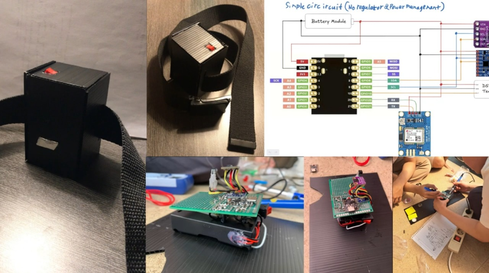
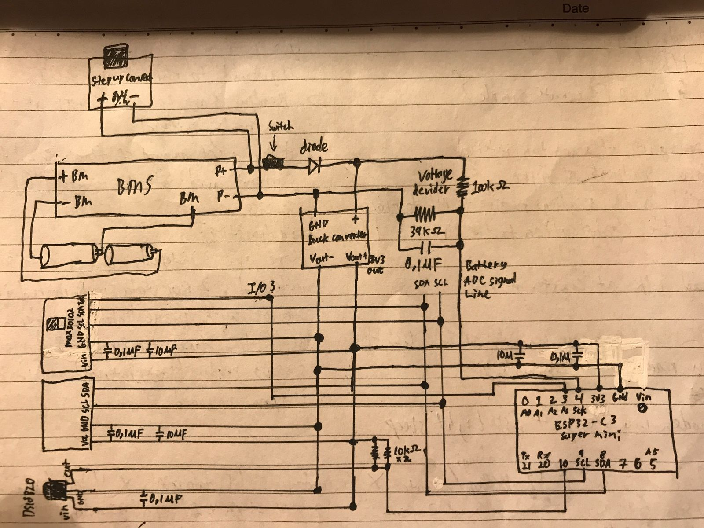
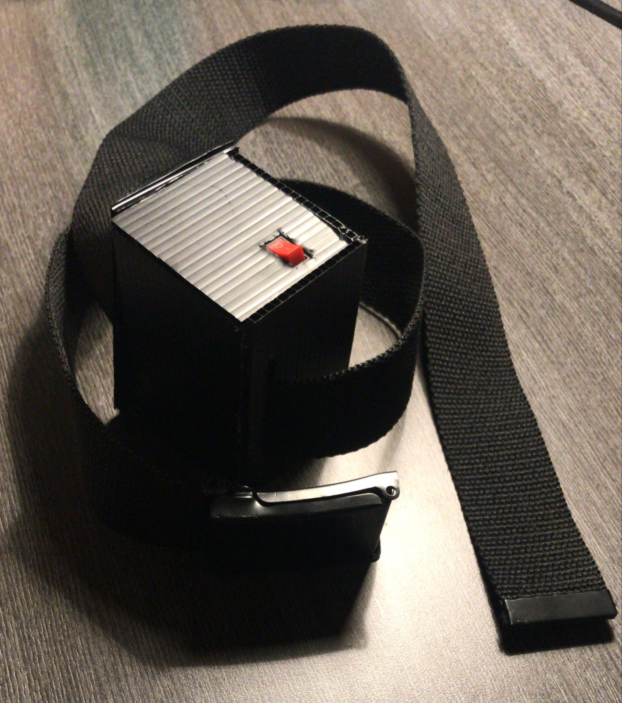
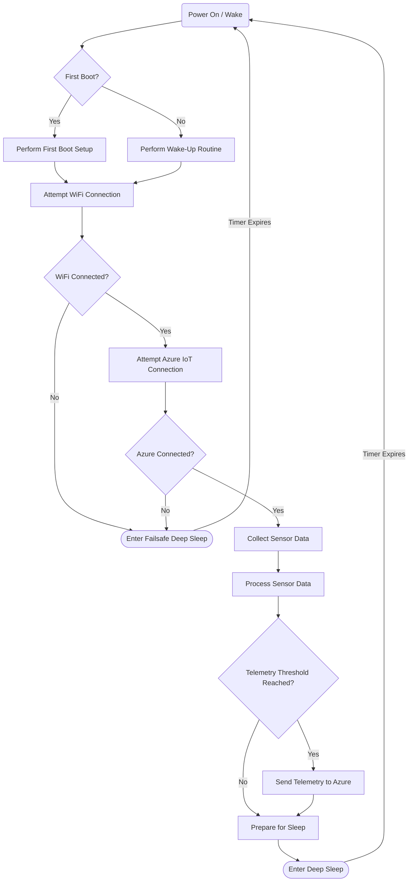
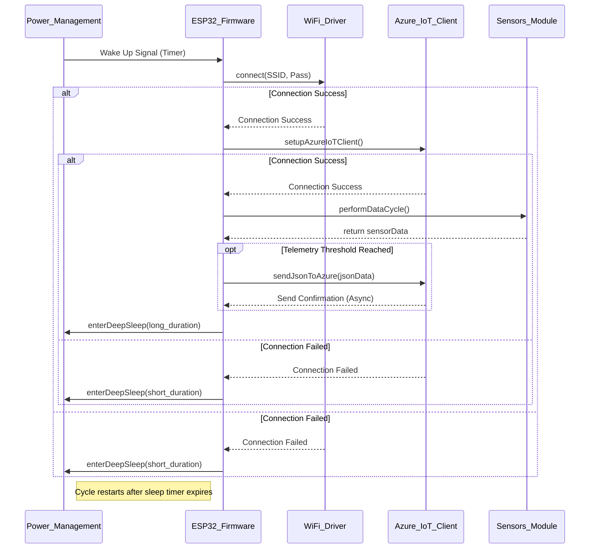
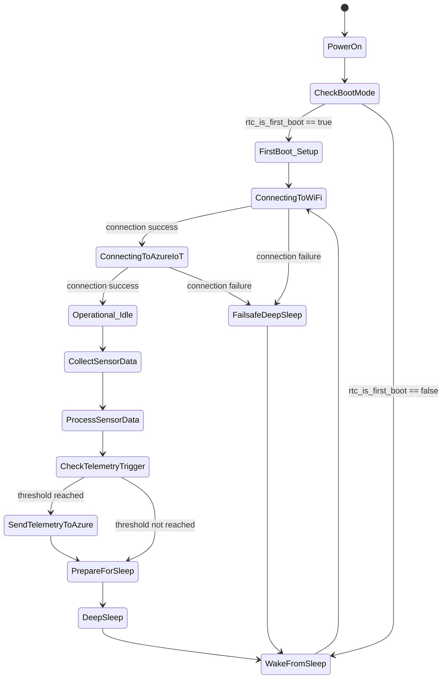

# Moorgan-IoT: Smart Health & Activity Monitor For Cows 🐄

[![Platform][platform-badge]][platform-link]
[![Framework][framework-badge]][framework-link]
[![Language][language-badge]][language-link]
[![License][license-badge]](LICENSE)
[![Status][status-badge]](#)

> An advanced IoT solution for real-time monitoring of health and environmental metrics using an ESP32-C3, various sensors, and the Azure IoT Hub. This repository contains the firmware for the IoT device.

This project is designed to be a robust, power-efficient IoT device that captures sensor data, processes it, and securely transmits it to the cloud for further analysis and visualization. It features a sophisticated power management system with deep sleep cycles and seamless Wi-Fi provisioning via Bluetooth LE.

-----

### ✨ Key Features

  * **Multi-Sensor Data Fusion:**
      * 🌡️ **Temperature:** Reads ambient temperature using a `DS18B20` sensor.
      * ❤️ **Health Vitals:** Measures Heart Rate and SpO2 levels with a `MAX30102` sensor.
      * 🏃 **Motion Tracking:** Captures 6-axis motion data (accelerometer + gyroscope) using an `MPU6050`.
      * 🔋 **Battery Monitoring:** Actively monitors the battery level to ensure device longevity.
  * **☁️ Cloud Integration:**
      * Securely connects and sends telemetry data to **Azure IoT Hub**.
      * Uses MQTT protocol for efficient and reliable communication.
  * **Advanced Power Management:**
      * Utilizes **deep sleep** functionality to dramatically reduce power consumption between readings.
      * Wakes up periodically, reads data, sends it, and returns to sleep, making it ideal for battery-powered applications.
  * **💡 Smart Provisioning:**
      * **Bluetooth LE Provisioning:** Allows users to set up Wi-Fi credentials easily from a smartphone app without hardcoding them.
      * **Resilient Connectivity:** Automatically attempts to reconnect to Wi-Fi and can re-enter provisioning mode if connection is persistently lost.
  * **On-Device Data Processing:**
      * Applies windowing and calculates mean/standard deviation for MPU6050 motion data to extract meaningful features before transmission.
      * Processes raw PPG (photoplethysmography) data to calculate Heart Rate and SpO2 with noise filtering.

-----

## 📸 Showcase

<table align="center">
  <tr>
    <td align="center">
      
      <br>
      <sub><b>Project Showcase</b></sub>
    </td>
    <td align="center">
      
      <br>
      <sub><b>Circuit Scheme</b></sub>
    </td>
    <td align="center">
      
      <br>
      <sub><b>Device Top View</b></sub>
    </td>
  </tr>
</table>


-----

## 🛠️ Hardware & Software Stack

### Hardware Components

  * **Microcontroller:** ESP32-C3 DevKitM-1
  * **Sensors:**
      * `MPU6050` Inertial Measurement Unit
      * `MAX30102` Pulse Oximeter and Heart-Rate Sensor
      * `DS18B20` Digital Temperature Sensor
  * **Power:** Li-Ion Battery with a voltage monitoring circuit.

### Software & Libraries

  * **Platform:** [PlatformIO][platform-link]
  * **Framework:** [Arduino][framework-link]
  * **Cloud Backend:** [Azure IoT Hub][azure-link]
  * **Key Libraries:**
      * `AzureIoTHub` & `AzureIoTProtocol_MQTT` for cloud connectivity.
      * `ArduinoJson` for serializing data for transmission.
      * `DS18B20` library for the temperature sensor.
      * Custom drivers for `MPU6050` and `MAX30102`.

-----

## 🏗️ System Architecture

The device operates in a cyclical manner optimized for low power consumption:

1.  **Wake Up:** The ESP32-C3 wakes from deep sleep, triggered by a timer. It retains its boot count across sleep cycles using `RTC_DATA_ATTR`.
2.  **Connect:** It connects to the pre-configured Wi-Fi network. If no credentials are stored, it enters **BLE provisioning mode** (BLE Provisioning service is turned of by default because of resource limitation on the ESP32-C3).
3.  **Collect Data:** It polls all connected sensors (`MAX30102`, `MPU6050`, `DS18B20`) and the battery monitor for new readings.
4.  **Process Data:** The raw sensor data is processed on-device to calculate metrics like heart rate, SpO2, and motion features.
5.  **Transmit Data:** The processed data is serialized into a JSON payload and sent to the Azure IoT Hub.
6.  **Deep Sleep:** After successfully sending the data, the device goes back into deep sleep for a configured interval (`MICROSECOND_SLEEP`) to conserve power.

<details>
<summary><strong>Flowchart</strong></summary>


</details>

<details>
<summary><strong>Sequence Diagram</strong></summary>


</details>

<details>
<summary><strong>State Diagram</strong></summary>


</details>


-----

## 🚀 Getting Started

### Prerequisites

1.  Install [Visual Studio Code](https://code.visualstudio.com/).
2.  Install the [PlatformIO IDE extension](https://platformio.org/platformio-ide) in VS Code.
3.  Clone this repository.

### Configuration

If `NO_PROVISIONING` is defined in the config.h file, before uploading the firmware, you need to provide your credentials:

1.  Navigate to `lib/config/`.
2.  Create a file named `secreets.h` from `secreets.h.example` or edit the existing one.
3.  Add your Wi-Fi and Azure IoT Hub Device Connection String details:

<!-- end list -->

```cpp
// lib/config/secreets.h

#define WIFI_SSID "YOUR_WIFI_SSID"
#define WIFI_PASSWORD "YOUR_WIFI_PASSWORD"
#define IOTHUB_CONNECTION_STRING "YOUR_AZURE_IOT_HUB_DEVICE_CONNECTION_STRING"
```

> **Note:** For initial setup, you can leave the Wi-Fi credentials blank and use the **BLE provisioning flow** to configure them with your smartphone.

### Build & Upload

1.  Open the project folder in VS Code.
2.  PlatformIO will automatically detect the `platformio.ini` file and download the required dependencies.
3.  Connect your ESP32-C3 device.
4.  Use the PlatformIO toolbar to **Build** and then **Upload** the project.

### Provisioning the Device via BLE
> **Note:** If you are setting up the device for the first time without hardcoding Wi-Fi credentials in `secreets.h`, you can provision it using Bluetooth Low Energy (BLE) and a smartphone app.

**1. Install the App:** On your smartphone, install a compatible Wi-Fi provisioning app.
* **Android:** [ESP BLE Prov](https://play.google.com/store/apps/details?id=com.espressif.provble)
* **iOS:** [ESP BLE Provisioning](https://apps.apple.com/us/app/esp-ble-provisioning/id1473215902)

**2. Flash the Firmware:** Build and upload the project to your ESP32-C3. The device will now be discoverable via BLE.

**3. Connect and Send Credentials:** You can connect to the device using one of two methods:

**Method A: Using the QR Code (Recommended)**
1.  Open the Serial Monitor in PlatformIO. You will see boot messages, followed by a **QR Code**.
2.  In the app, choose the option to scan a QR code and scan the one from the Serial Monitor.
3.  The app will connect automatically.

**Method B: Manual Connection**
1.  If you don't have access to the Serial Monitor, open the app and tap on "Provision Device" (or a similar option).
2.  The app will scan for nearby BLE devices. Look for a device named **`PROV_moorgan_colar`** and select it.
3.  You may be prompted for a "Proof of Possession" (POP) or password. If one is configured, enter it.

**4. Final Step (For Both Methods):**
* Once connected, the app will prompt you to select a Wi-Fi network (SSID) and enter its password.
* Enter your credentials and send them to the device.
* The device will then connect to your Wi-Fi, and the provisioning process is complete. It will remember these credentials for future boots.

-----

## 📚 Complete Documentation & Project Links

  * \*\* Notion Documentation (Detailed):\*\* [Moorgan Documentation](https://stanley-n-wijaya.notion.site/Moorgan-Documentation-1df73555b71f80fd9fd9dbfc655ce5a7?pvs=4)
  * \*\* Demo Video:\*\* [Link to Demo Video on SharePoint](https://binusianorg-my.sharepoint.com/personal/stanley_wijaya004_binus_ac_id/_layouts/15/guestaccess.aspx?share=EYMWsQ71C9NHv2bWAHrP4L8BMcDJ3e6a9U_hsyYi_i-wlw&nav=eyJyZWZlcnJhbEluZm8iOnsicmVmZXJyYWxBcHAiOiJPbmVEcml2ZUZvckJ1c2luZXNzIiwicmVmZXJyYWxBcHBQbGF0Zm9ybSI6IldlYiIsInJlZmVycmFsTW9kZSI6InZpZXciLCJyZWZlcnJhbFZpZXciOiJNeUZpbGVzTGlua0NvcHkifX0&e=eWRR7c)
  * \*\* Moorgan Google Drive:\*\* [Documents + Preliminary Research](https://drive.google.com/drive/folders/1Slexo254LAhwieCQazA-peBe4Vl8fZJ5?usp=sharing)

-----

## 🌐 All GitHub Repositories

  * **Main Repository:** [StyNW7/Moorgan](https://github.com/StyNW7/Moorgan)
  * **Frontend Repository:** [StyNW7/Moorgan-Frontend](https://github.com/StyNW7/Moorgan-Frontend)
  * **Backend Repository:** [StyNW7/Moorgan-Backend](https://github.com/StyNW7/Moorgan-Backend)
  * **AI Repository:** [StyNW7/Moorgan-AI](https://github.com/StyNW7/Moorgan-AI)
  * **IoT Repository (You are here):** [StyNW7/Moorgan-IoT](https://github.com/StyNW7/Moorgan-IoT)

[platform-badge]: https://img.shields.io/badge/Platform-PlatformIO-orange.svg
[framework-badge]: https://img.shields.io/badge/Framework-Arduino-00979D.svg
[language-badge]: https://img.shields.io/badge/Language-C%2B%2B-blue.svg
[license-badge]: https://img.shields.io/badge/License-MIT-yellow.svg
[status-badge]: https://img.shields.io/badge/Status-In%20Progress-brightgreen

[platform-link]: https://platformio.org/
[framework-link]: https://www.arduino.cc/
[language-link]: https://isocpp.org/
[azure-link]: https://azure.microsoft.com/en-us/services/iot-hub/